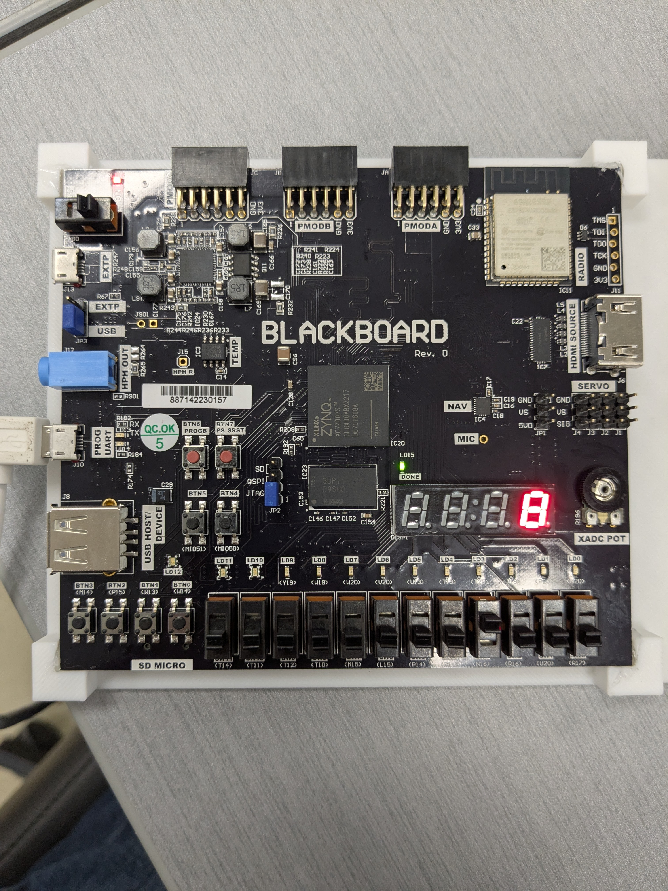

# BCD-to-Seven-Segment-FPGA-Converter

## Project Overview

The objective of this project was to design and implement a combinational logic circuit that converts a 4-bit Binary Coded Decimal (BCD) input into signals for a decimal 7-segment display. The workflow involved Boolean algebra simplification using Karnaugh Maps (K-maps), simulation in Logisim, and final implementation using Verilog data-flow modeling on an FPGA board.

### Technical Specifications

Design Method: K-map simplification for Boolean logic.

Modeling Style: Verilog Data-Flow modeling.

Tools: Vivado 2023.1 , Logisim.

Target Hardware: Blackboard FPGA board.

## 1. Logic Design and Simplification

The design began with a truth table mapping 4-bit BCD values (0000–1001) to seven outputs (a through g), each representing a segment of the display.

### BCD to 7-Segment Truth Table
| w | x | y | z | a | b | c | d | e | f | g |
|---|---|---|---|---|---|---|---|---|---|---|
| 0 | 0 | 0 | 0 | 0 | 0 | 0 | 0 | 0 | 0 | 1 |
| 0 | 0 | 0 | 1 | 1 | 0 | 0 | 1 | 1 | 1 | 1 |
| 0 | 0 | 1 | 0 | 0 | 0 | 1 | 0 | 0 | 1 | 0 |
| 0 | 0 | 1 | 1 | 0 | 0 | 0 | 0 | 1 | 1 | 0 |
| 0 | 1 | 0 | 0 | 1 | 0 | 0 | 1 | 1 | 0 | 0 |
| 0 | 1 | 0 | 1 | 0 | 1 | 0 | 0 | 1 | 0 | 0 |
| 0 | 1 | 1 | 0 | 0 | 1 | 0 | 0 | 0 | 0 | 0 |
| 0 | 1 | 1 | 1 | 0 | 0 | 0 | 1 | 1 | 1 | 1 |
| 1 | 0 | 0 | 0 | 0 | 0 | 0 | 0 | 0 | 0 | 0 |
| 1 | 0 | 0 | 1 | 0 | 0 | 0 | 1 | 1 | 0 | 0 |
| 1 | 0 | 1 | 0 | X | X | X | X | X | X | X |
| 1 | 0 | 1 | 1 | X | X | X | X | X | X | X |
| 1 | 1 | 0 | 0 | X | X | X | X | X | X | X |
| 1 | 1 | 0 | 1 | X | X | X | X | X | X | X |
| 1 | 1 | 1 | 0 | X | X | X | X | X | X | X |
| 1 | 1 | 1 | 1 | X | X | X | X | X | X | X |

To minimize hardware resources, I used K-maps to simplify the function for each output segment.

### Simplified Boolean Expressions

The following expressions were derived for the seven display segments:

Segment a: F = xy′z′ + w′x′y′z 

Segment b: F = xy′z + xyz′

Segment c: F = x′yz′

Segment d: F = x′y′z + xy′z′ + xyz

Segment e: F = xy′ + z

Segment f: F = w′x′z + yz + x′y

Segment g: F = w′x′y′ + xyz

## 2. Simulation and Verification

Prior to hardware implementation, I designed and verified the logic circuit in Logisim, to insure that the expected behaviour resulted from the simplification process.

## 3. FPGA Implementation (Verilog)

The converter was programmed in Verilog using Data-Flow Modeling. This higher-level approach was chosen because it is more practical, efficient, and readable for highly complex circuits compared to gate-level modeling.

### Verification in Vivado

The design successfully completed the following milestones in Vivado 2023.1:

Synthesis: Successful.

Implementation: Successful.

Bitstream Generation: Successfully completed for hardware deployment.

## 4. Hardware Testing and Results

The final bitstream was loaded onto the Blackboard FPGA. I verified the design by toggling the onboard switches in BCD configurations and observing the corresponding decimal output on the 7-segment display.

## 5. Conclusion

The implementation of this converter was successful, with Logisim simulation results directly matching the FPGA board implementation as expected. While designing for seven concurrent outputs was challenging, it provided hands-on experience in industry-relevant practices for building common logical circuits.
